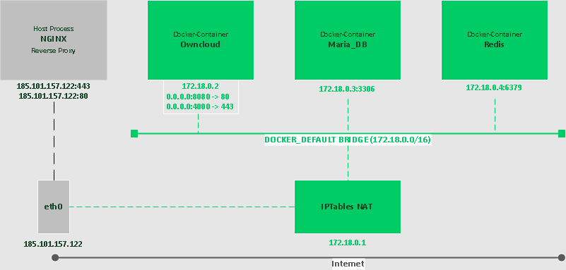
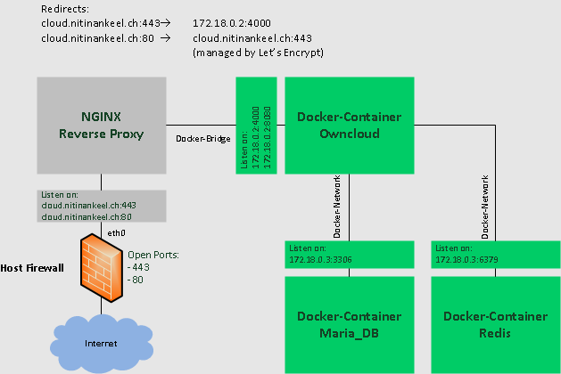

# Docker
Nitinan Keel </br>
Containerization of application and services

## Table of contents
* [Concept]
  * [Requierements]
  * [Docker Network]
  * [IP-Table]
  * [Reverse proxy]
* [Installation]
  * [Setup external server]
  * [NGINX service]
    * [Reverse proxy configuration]
    * [SSL with Let's Encrypt]
  * [Docker-Compose File]
* [Testing]
* [Project review]

## Concept
### Requierements

* [Ubuntu Server 16.04](https://www.ubuntu.com/download/server)
* [Plain NGINX installation](https://docs.nginx.com/nginx/admin-guide/installing-nginx/installing-nginx-open-source/)
* [Docker CE](https://store.docker.com/editions/community/docker-ce-server-ubuntu)
* [Docker-compose](https://docs.docker.com/compose/)

### Docker Network
Network diagram between Docker Network and Physical Network.



Network diagram between NGINX Reverse Proxy and Docker Ports.



### IP-Table
| Docker / Host | IP-Address | Ports | Description |
| ------------- | ---------- | ----- | ----------- |
| Owncloud | 172.18.0.2 /16 | TCP 8080, TCP 4000 | Owncloud Docker |
| Maria_DB | 172.18.0.3 /16 | TCP 3306 | Maria SQL Docker |
| Redis | 172.18.0.4 /16 | TCP 6379 | Redis Docker |
| Nitinankeel.ch | 172.18.0.1 /16 | - | Docker-Bridge |
| Nitinankeel.ch | 185.101.157.122 /24 | TCP 443, 80 | Reverse proxy redirection |

### Reverse proxy
| From-Address | From-Port | To-Address | To-Port | Description |
| ------------ | --------- | ---------- | ------- | ----------- |
| cloud.nitinankeel.ch | 443 | 172.18.0.2 | 4000 | HTTPS to Docker |
| cloud.nitinankeel.ch | 80 | cloud.nitinankeel.ch | 443 | HTTP to HTTPS redirect |

## Installation
### Setup external server
I'm using the UFW on my Server. In order to accept HTTP and HTTPS traffic with a firewall, you need to open those ports.
Just run these commands:
```sh
sudo ufw allow HTTP
sudo ufw allow HTTPS
sudo ufw reload
```
Now we need to configure the NGINX service.

### NGINX service
Because I have multiple services, which needs the ports 80 and 443, I'll setup a reverse proxy with NGINX.

#### Reverse proxy configuration
In my network diagram above, you can see, that the reverse proxy will listen for incomming traffic on cloud.nitinankeel.ch and will then redirect it to my docker container.

Just add a new site in your NGINX config folder (``/etc/nginx/sites-available/``):

```BASH
vim /etc/nginx/sites-available/cloud.nitinankeel.ch
```

Paste this in:
```NGINX   
server {
	server_name www.cloud.nitinankeel.ch; # Change this
	return 301 $scheme://cloud.nitinankeel.ch$request_uri; # Change this
}
server { 
        index index.php index.html index.htm;
        server_name cloud.nitinankeel.ch; # Change this
        location / {
        proxy_pass http://127.0.0.1:8080;
        }

         location ~ /\.ht {
                deny all;
        }
}
server {
        listen 80;
}
```
Save and close.

#### SSL with Let's Encrypt
Now the proxy is just listenning to HTTP.
To enable HTTPS, [install](https://www.digitalocean.com/community/tutorials/how-to-secure-nginx-with-let-s-encrypt-on-ubuntu-16-04) the Certbot Agent.

### Docker-Compose File
Create a new folder and a docker-compose.yml file:
```BASH
mkdir /docker/owncloud/
touch /docker/owncloud/docker-compose.yml
```
Paste this in your docker-compose.yml file:
```yaml 
# Docker-Compose File Version
version: '2.1'

# Local volumes / Persistent volumes
volumes:
  files:
    driver: local
  mysql:
    driver: local
  backup:
    driver: local
  redis:
    driver: local

# Start defining docker container
services:
  # Start defining owncloud docker
  owncloud:
    # Owncloud Version = latest and greatest
    image: owncloud/server:latest
    # Restart after reboot
    restart: always
    # Bind Port 443 to 4000 --> To Docker network NOT physical Network
    # Bind Port 80 to 8080 --> To Docker network NOT physical Network
    ports:
      - 4000:443
      - 8080:80
    # Create and start these services too
    depends_on:
      - db
      - redis
    # Variable to define
    environment:
      - OWNCLOUD_DOMAIN=cloud.nitinankeel.ch # Change this to your domain
      - OWNCLOUD_DB_TYPE=mysql
      - OWNCLOUD_DB_NAME=owncloud
      - OWNCLOUD_DB_USERNAME=dbuser # Change the Maria DB username if you want
      - OWNCLOUD_DB_PASSWORD=******** # Insert your DB user password
      - OWNCLOUD_DB_HOST=db
      - OWNCLOUD_ADMIN_USERNAME=adminuser # Change the owncloud admin user
      - OWNCLOUD_ADMIN_PASSWORD=******* # Insert your admin user password
      - OWNCLOUD_UTF8MB4_ENABLED=true
      - OWNCLOUD_REDIS_ENABLED=true
      - OWNCLOUD_REDIS_HOST=redis
    # Check if owncloud is up
    healthcheck:
      test: ["CMD", "curl", "-f", "http://localhost/status.php"]
      # Change interval and timeout if you want
      interval: 30s
      timeout: 10s
      retries: 5
    # Mount the data folder -- Is persistent
    volumes:
      - files:/mnt/data

  # Start defining mariadb docker
  db:
    # Version of maria DB is latest and greatest
    image: webhippie/mariadb:latest
    # Start docker after server restart
    restart: always
    # Variable to define
    environment:
      - MARIADB_ROOT_PASSWORD=********* # Insert the DB root password
      - MARIADB_USERNAME=dbuser # Insert the OWNCLOUD_DB_USERNAME from above
      - MARIADB_PASSWORD=******** # Insert the OWNCLOUD_DB_PASSWORD from above
      - MARIADB_DATABASE=owncloud
      - MARIADB_MAX_ALLOWED_PACKET=128M
      - MARIADB_INNODB_LOG_FILE_SIZE=64M
      - MARIADB_INNODB_LARGE_PREFIX=ON
      - MARIADB_INNODB_FILE_FORMAT=Barracuda
    # Check if mariadb is up
    healthcheck:
      test: ["CMD", "/usr/bin/healthcheck"]
      # Change interval and timeout if you want
      interval: 30s
      timeout: 10s
      retries: 5
    # Mount the database and the backup folder -- Is persistent 
    volumes:
      - mysql:/var/lib/mysql
      - backup:/var/lib/backup

  # Start defining redis docker
  redis:
    # Version of redis is latest and greatest
    image: webhippie/redis:latest
    # Start docker after server restart
    restart: always
    # Variable to define
    environment:
      - REDIS_DATABASES=1
    # Check if redis is up
    healthcheck:
      test: ["CMD", "/usr/bin/healthcheck"]
      # Change interval and timeout if you want
      interval: 30s
      timeout: 10s
      retries: 5
    # Mount the redis folder -- Is persistent
    volumes:
      - redis:/var/lib/redis
